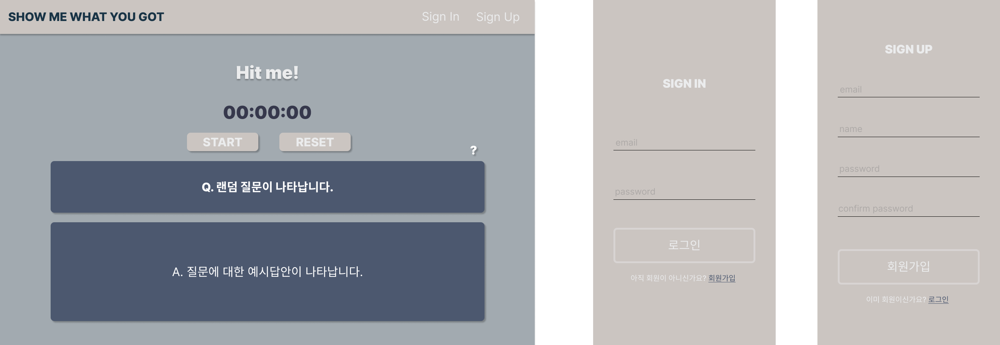

# 쇼미

Show me what you got.

## Figma Design

link : https://www.figma.com/file/KaTcyyxCmQVfE37DbQmYeA/%EC%87%BC%EB%AF%B8?node-id=0%3A1

메인, 로그인, 회원가입 페이지로 구성

 

 
## 요구사항

### 메인 페이지

1. "Sign in" 버튼을 클릭하면 로그인 페이지가 팝업된다.
2. "Sign up" 버튼을 클릭하면 회원가입 페이지가 팝업된다.
3. "Hit me!" 버튼을 클릭하면 리셋된 스톱워치와 함께 질문 창과 오른쪽 물음표 버튼이 나타난다.
4. 물음표 버튼을 클릭하면 예시답안이 토글된다.

### 로그인 페이지
로그인

### 회원가입 페이지
회원가입
